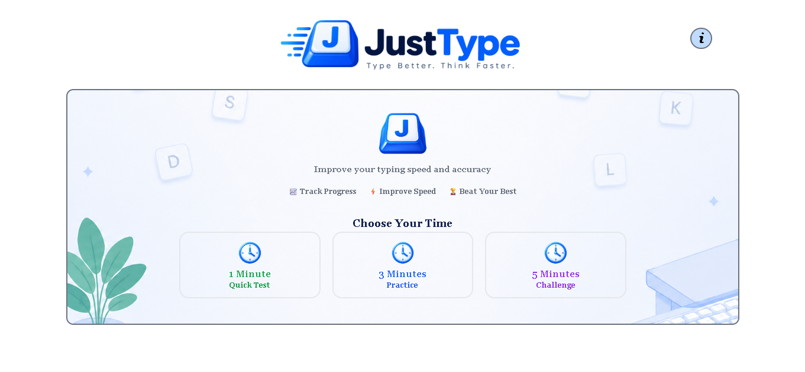
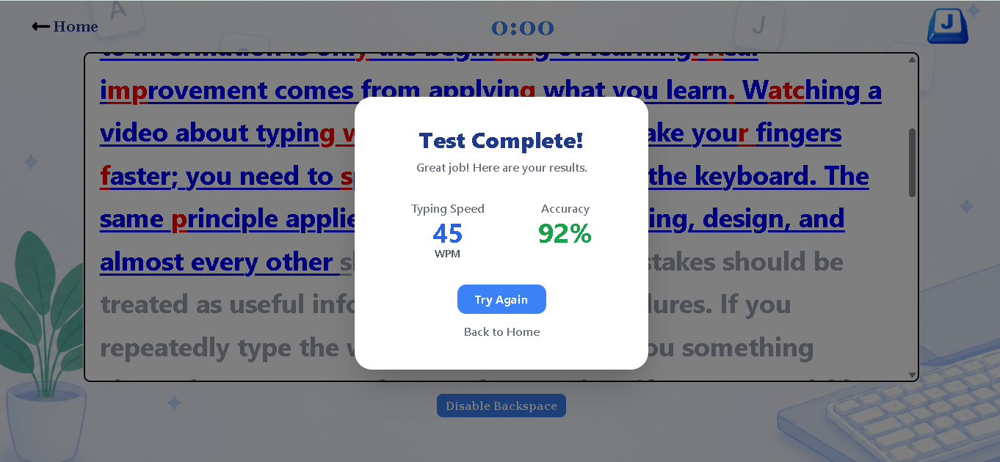

# ⌨️ JustType

**JustType** is a simple and interactive typing test that helps you improve your typing speed, accuracy, and consistency — built as a frontend project to practice UI design, DOM manipulation, event handling, and JavaScript logic.

🔗 **Live Demo:** [Add your GitHub Pages / deployment link here]





---

## ✨ Features

- ⏱️ 1-minute, 3-minute, and 5-minute typing tests
- ⌨️ Real-time typing practice with live character feedback (correct/incorrect highlighting)
- 📊 WPM (Words Per Minute) and accuracy tracking
- ❌ Error tracking as you type
- 🔒 Option to disable/enable Backspace for stricter practice
- 📱 Responsive and clean user interface
- ⚡ Fast, lightweight, dependency-light frontend application

---

## 🛠️ Built With

- **HTML5** — page structure
- **Tailwind CSS v3** — styling (via PostCSS + Autoprefixer)
- **Vite** — dev server and build tool
- **JavaScript (Vanilla)** — core logic (timer, WPM/accuracy calculation, key handling)
- **jQuery** — DOM manipulation and event handling

---

## 📂 Project Structure

```
JustType/
├── images/                 # Logo, icons, backgrounds
├── node_modules/           # Installed dependencies (not committed)
├── .gitignore
├── index.html               # Home page — choose test duration
├── index.js                 # Shared app logic (paragraphs, timer, key handling, scoring)
├── input.css                 # Tailwind entry file (@tailwind base/components/utilities)
├── package.json
├── package-lock.json
├── postcss.config.js         # PostCSS config (Tailwind + Autoprefixer)
├── README.md
├── right-click.mp3           # Correct keystroke sound
├── site.webmanifest
├── tailwind.config.js        # Tailwind config
├── typing.html                # Typing test page
└── wrong-click.mp3            # Incorrect keystroke sound
```

---

## 🚀 Getting Started

This project uses **Vite** as the dev server and **Tailwind CSS v3** (via PostCSS) for styling, so you'll need Node.js installed.

### 1. Clone the repo
```bash
git clone https://github.com/Inam-Ul-Haq-Baba/JustType.git
cd JustType
```

### 2. Install dependencies
```bash
npm install
```

### 3. Run the dev server
```bash
npm run start
```
This runs `vite` and starts a local dev server (Tailwind's IntelliSense/autocomplete works best after restarting your editor once, if you're using VS Code).

### 4. Build for production
```bash
npm run build
```
This runs `vite build` and outputs a production-ready build you can deploy (e.g. to GitHub Pages, Netlify, or Vercel).

---

## 🎮 How It Works

1. Choose a test duration on the home page — **1**, **3**, or **5 minutes**.
2. A random paragraph is loaded for the selected duration.
3. Start typing — the timer begins on your first keystroke.
4. Characters turn **blue** when typed correctly and **red** when typed incorrectly.
5. When the timer runs out (or you finish the paragraph), your **WPM** and **accuracy** are calculated and shown in a results modal.
6. Use **Disable Backspace** if you want a stricter, no-correction practice mode.

---

## 🧮 How Stats Are Calculated

- **WPM** = (characters typed ÷ 5) ÷ minutes elapsed
- **Accuracy** = (correctly typed characters ÷ total characters typed) × 100

---

## 🐛 Known Limitations / Roadmap

- WPM is currently calculated from total characters typed rather than only correct ones (gross vs. net WPM) — net WPM may be added later for a more standard scoring method.
- No handling yet for visiting `typing.html` directly without a valid `?time=` parameter.
- No mobile virtual keyboard optimization yet.
- No persistent history/leaderboard of past results (all results reset on reload).
- Planned: dark mode, custom paragraph upload, per-character error breakdown.

---

## 📄 License

This project is licensed under the [MIT License](./LICENSE).

---

## 🙋‍♂️ Author

Built by **Inam-Ul-Haq Baba** as a frontend development project to practice UI design, DOM manipulation, event handling, timers, and responsive web design.